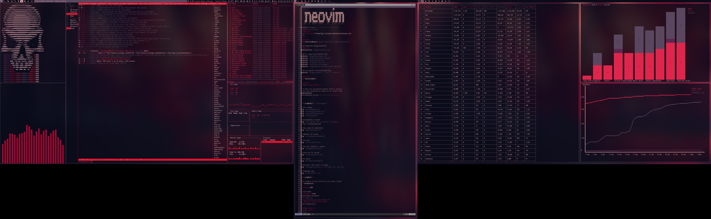

***st - simple terminal***
--------------------
st is a simple terminal emulator for X which sucks less.

*Get this theme from https://github.com/plasmoduck/themes/red*

**Patches include:**

 Alpha - Transparency 

Scrollback - Mouse scrolling

Clipboard - Copy & paste

Boxdraw perfect boxes

Sync - Eliminate terminal flicking/tearing.

Requirements
------------
In order to build st you need the Xlib header files.

Installation
------------
Edit config.mk to match your local setup (st is installed into
the /usr/local namespace by default).

Afterwards enter the following command to build and install st (if
necessary as root):

    make clean install

Running st
----------
If you did not install st with make clean install, you must compile
the st terminfo entry with the following command:

    tic -sx st.info

See the man page for additional details.

Credits
-------
Thanks to the suckless org (http://suckless.org) Based on Aurélien APTEL <aurelien dot aptel at gmail dot com> bt source code.

